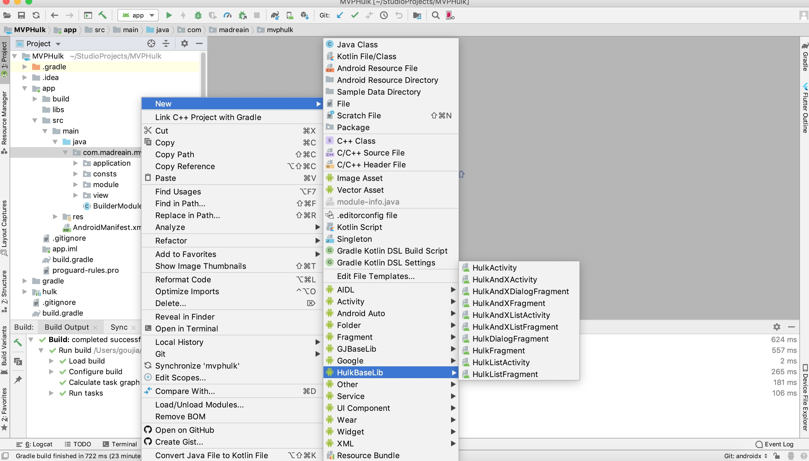

# MVPHulkTemplate
一键搭建MVPHulk的官方架构，支持Activity、ListActivity、Fragment、ListFragment、DialogFragment(并且支持最新AndroidX)的快速创建

### 安装

AndroidStudio MVPHulkTemplate模版存放路径：

Windows : AS安装目录/plugins/android/lib/templates/gradle-projects

Mac : /Applications/Android Studio.app/Contents/plugins/android/lib/templates/gradle-projects

放进去之后，重启AndroidStudio

### 使用

选择包名->new->HulkBaseLib->选择对应的去生成
